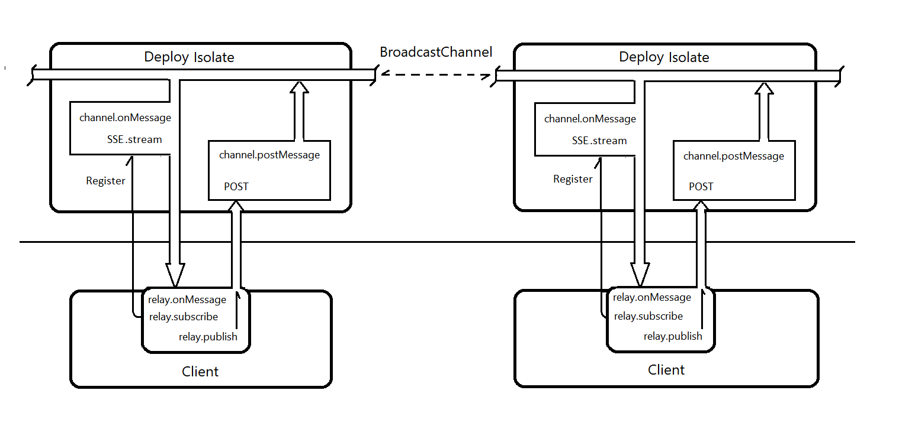

# Relay
## A Deno Streaming Pub/Sub service   
 
Relay is a simple peer-to-peer communication microservice.    

To test this service, see https://github.com/nhrones/RelayClient

On Deno Deploy, Relay can create a world-wide real-time event bus.   
Relay can distribute any json-payload, including; app-events, database-updates, or analytics-events.  

Relay is stateless, and requires zero configuration.  Any message-payload that can be json-stringified, can be published on Relay.
   
In this pub/sub model, any message `published` to a channel is immediately   
received by all `subscribers` to that channel. Relay...

  - Watches Port 9099 for subscriptions or published messages.
  - Streams all published messages to all subscribers using Server Sent Events.
  - Leverages Deno-BroadcastChannel to bridge deploy isolates and regions.



# Subscribe 
## Server Sent Events registration
To subscribe to Relay messages, we instantiate a new EventSource with a channel name as follows:
```ts 
// port 9099 is just a convention I use for Relay
const relayURL = `https://localhost:9099/subscribe/?channel="LOG"`;
const relayStream = new EventSource(relayURL);
```
[<font size="5">Click here to read more about Subscriptions.</font>](docs/subscribe.md) 

# Publish

To publish a payload to a channel, we simply use fetch to 'POST' the serialized payload to the Relay service provider (localhost:9099).  
 
NOTE: anything that can be stringified, can be places in the `body` of the request.   
The one exception is that it must contain a string property named `channel`. This property is used to stream messages to all subscribers of that channel.  

[<font size="5">Click here to read more about Publishing.</font>](docs/publish.md) 

